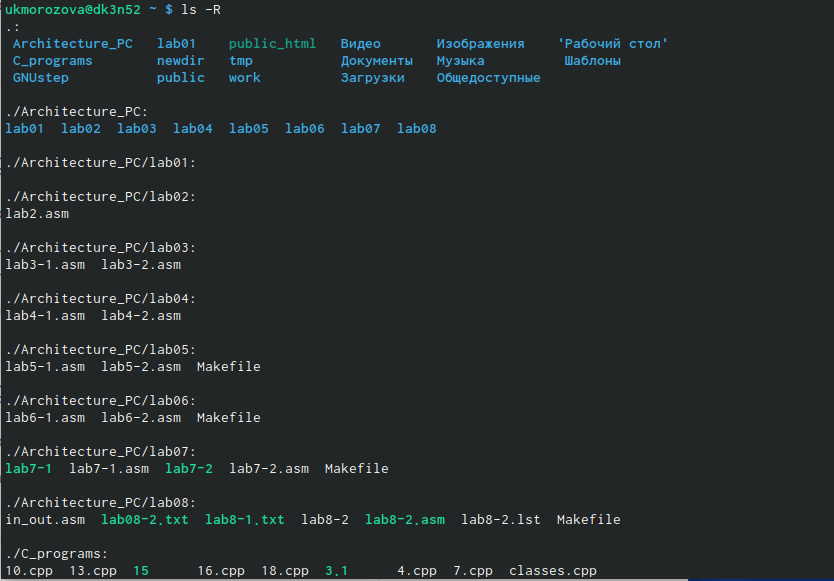

---
## Front matter
title: "Отчёт по лабораторной работе №4"
subtitle: "Операционные системы"
author: "Морозова Ульяна Константиновна"

## Bibliography
bibliography: bib/cite.bib
csl: pandoc/csl/gost-r-7-0-5-2008-numeric.csl

## Pdf output format
toc-depth: 2
fontsize: 12pt
linestretch: 1.5
papersize: a4
documentclass: scrreprt
## I18n polyglossia
polyglossia-lang:
  name: russian
  options:
	- spelling=modern
	- babelshorthands=true
polyglossia-otherlangs:
  name: english
## I18n babel
babel-lang: russian
babel-otherlangs: english
## Fonts
mainfont: PT Serif
romanfont: PT Serif
sansfont: PT Sans
monofont: PT Mono
mainfontoptions: Ligatures=TeX
romanfontoptions: Ligatures=TeX
sansfontoptions: Ligatures=TeX,Scale=MatchLowercase
monofontoptions: Scale=MatchLowercase,Scale=0.9
## Biblatex
biblatex: true
biblio-style: "gost-numeric"
biblatexoptions:
  - parentracker=true
  - backend=biber
  - hyperref=auto
  - language=auto
  - autolang=other*
  - citestyle=gost-numeric

## Misc options
indent: true
header-includes:
  - \usepackage{indentfirst}
  - \usepackage{float} 
---

# Цель работы

Приобретение практических навыков взаимодействия пользователя с системой посредством командной строки.

# Выполнение лабораторной работы

1. Определим полное имя нашего домашнего каталога, для этого используем команду pwd (рис.1).


2. В домашнем каталоге перейдем в папку tmp с помощью команды cd /var/tmp (рис.2)


Выведем на экран содержимое каталога /tmp (команда ls с различными опциями) (рис.3).


В первый раз когда мы ввыодили команду ls терминал вывел нам только список каталогов и файлов, которые хранятся в папке tmp. Во второй раз при вводе команды ls -alF терминал вывел не только название папок, но и права доступа, дату последнего изменения, владельцев папок, число ссылок. Разница между выводимой информацией объясняется тем, что мы используем различные опции команды ls. Также с помощью команды ls -a можно посмотреть скрытые папки (рис.4).


Теперб определим, если в каталоге /var/spool подкаталог с именем cron (рис.5). Для этого сначала перейдем на уровень вверх, используя команду cd .., командой cd spool попадем в нужный нам каталог и с помощью команды ls увидим, что в каталоге spool действитльно есть подкаталог с именем cron.


Вернемся в наш домашний каталог (команда cd ~) и узнаем, кто является владльцем файлов и каталогов с помощью команды ls -l (рис.6).


Как мы видим из результатов работы терминала, все папки и файлы в домашнем каталге принадлежат пользователю ukmorozova.

3. В домашнем каталоге создадим новый каталог с именем newdir и в нем же новый каталог morefun (рис.7).


В домашнем каталоге создадим папки letters, memos, misk одной командой и удалим их тоже одной командой (рис.8), так как это пустые каталоги, то их можно удалить командой rmdir. 


Попробуем удалить ранее созданный каталог ~/newdir с помощью команды rm (рис.9). У нас это не получится, терминал выдаст ошибку, так как это каталог, а не файл. Чтобы это сделать, нужно использовать опции команды rm. 


Удалим каталог ~/newdir/morefun из домашнего каталога (рис.10). Сначала попробуем это сделать с помощью команды rm ~/newdir/morefun - терминал выдаст ошибку. Добавим опцию -r и увидим, что каталог удалился.


4. С помощью команды man ls определим, какую команду нам нужно использовать, чтобы просмотреть содержимое не только указанного каталога, но и подкаталогов, входящих в него. Это команда ls -R (рис.11-13).




5. Также с помощью команды man определим набор опций команды ls, позволяющий отсортировать по времени последнего изменения выводимый список содержимого каталога с развёрнутым описанием файлов (рис.14).


6. Используем команду man (рис.15), чтобы просмотреть описания команд cd (рис.16), pwd (рис.17), mkdir (рис.18), rmdir (рис.19), rm (рис.20).


Команда cd предназначена для перемаещения по файловой системе операционной системы Linux. Для определения абсолютного пути к текущему каталогу используется команда pwd. Команда mkdir используется для создания каталогов, ее синтаксис mkdir имя_каталога1 [имя_каталога2...]. Команда rm используется для удаления файлов и/или каталогов. Для удаления каталогов используют опцию этой команды -r. Команда rmdir нужна, чтобы удалять пустые каталоги, если каталог не пуст, система выдаст ошибку.

7. Используя информацию, полученную при помощи команды history (рис.21) (она выведет историю всех операций в терминале), выполним модификацию и исполнение нескольких команд (рис.22).


# Выводы

Я приобрела практические навыки взаимодействия пользователя с системой посредством командной строки.

# Контрольные вопросы

1. Взаимодействие пользователя с системой Linux (работа с данными и управление работающими в системе процессами) происходит в интерактивном режиме посредством командного языка. Оболочка операционной системы (или командная оболочка, интерпретатор команд) — интерпретирует (т.е. переводит на машинный язык) вводимые пользователем команды, запускает соответствующие программы (процессы), формирует и выводит ответные сообщения. Кроме того, на языке командной оболочки можно писать небольшие программы для выполнения ряда последовательных операций с файлами и содержащимися в них данными — сценарии (скрипты).

2. Абсолютный путь к текущему каталогу можно определить с помощью команды pwd.

3. С помощью команд ls, ls -a можно определить только название и формат файлов и каталогов. Отличаются они лишь тем, что вторая команда выводит также скрытые файлы и каталоги.

4. Скрытые файлы можно отобразить, введя в командную строку команду ls -a. 

5. Команда rm удаляет файлы, а с опцией -r также удаляет в том числе непустые каталоги. Пустые каталоги можно удалить, используя команду rmdir.

6. Команда history позволяет вывести на экран информацию о последних выполненных пользователем команд.

7. Команда history позволяет нам узнать номер выполненных команд, который нужен чтобы модифицировать их. Например, !<номер_команды>:s/<что_меняем>/<на_что_меняем>.

8. Чтобы запустить несколько команд в одной строке, достаточно написать их через точку с запятой. Например, cd; ls.

9. Если в заданном контексте (при модификации команд) встречаются специальные символы (типа «.», «/», «*» и т.д.), надо перед ними поставить символ экранирования \ (обратный слэш).

10. Команда ls -l позволяет увидеть права доступа и владельцев каталогов и файлов.

11. В случае абсолютной адресации путь к каталогу указывается, начиная с корневого каталога, и далее вниз по дереву папок до требуемого. При относительной адресации путь к каталогу указывается, начиная с текущего каталога (другими словами, относительно текущего каталога). Когда используется относительная адресация, слэш никогда не бывает первым знаком. 

Относительный и абсолютный путь используются в команде cd. Например,

``` language
cd ~/work/study
```

``` language
cd work/study
```

Используя и первую, и вторую команду, мы сможем попасть в папку study. Их отличе в том, что в первом случае мы указывали абсолютный путь, тогда как во втором - только относительный.

12. Чтобы полчуить информацию о какой-либо команде, нужно ввести man <имя_команды>. 

13. Клавиша Tab служит для автоматического дополнения вводимыз команд.

::: {#refs}
:::
