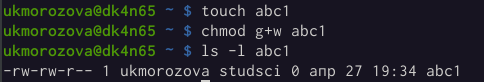

---
## Front matter
lang: ru-RU
title: Лабораторная рбота №5
author: Морозова Ульяна Константиновна
institute: RUDN University, Moscow, Russian Federation
date: 28 апреля 2022, Москва

## Formatting
toc: false
slide_level: 2
theme: metropolis
header-includes: 
 - '\makeatletter'
 - '\beamer@ignorenonframefalse'
 - '\makeatother'
aspectratio: 43
section-titles: true
---

# Суть работы

Изучение команд для работы с файлами и каталогами, в частности команды копирования, перемещения и переименнования, команды установки прав доступа.

# Копирование каталогов и файлов 

cp [-опции] исходный_файл целевой_файл

Создавая новые файлы и каталоги, мы работали с ними, применяя команду cp.

{ #fig:001 width=70% }

# Перемещение и переименнование файлов и каталогов

mv [-опции] старый_файл новый_файл

{ #fig:001 width=70% }

# Права доступа

chmod режим имя_файла

Помимо перемещения и копирования, мы также изменяли права доступа к файлам и каталогам. В зависимости от изменений, мы утрачивали какие-то возможности в отношении файлов/каталогов.

{ #fig:001 width=70% }

# Файловая система LINUX

Файловая система в Linux состоит из фалов и каталогов. Каждому физическому носителю соответствует своя файловая система.
Существует несколько типов файловых систем. Перечислим наиболее часто встречающиеся типы:
– ext2fs (second extended filesystem);
– ext2fs (third extended file system);
– ext4 (fourth extended file system);
– ReiserFS;
– xfs;
– fat (file allocation table);
– ntfs (new technology file system)

