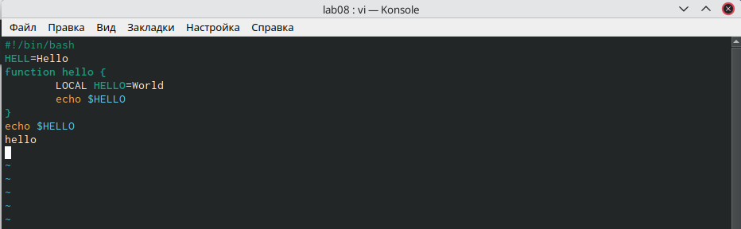

---
## Front matter
lang: ru-RU
title: Лабораторная работа №8
author: Морозова Ульяна Константиновна
institute: inst{1}RUDN University, Moscow, Russian Federation

## Formatting
toc: false
slide_level: 2
theme: metropolis
header-includes: 
 - \metroset{progressbar=frametitle,sectionpage=progressbar,numbering=fraction}
 - '\makeatletter'
 - '\beamer@ignorenonframefalse'
 - '\makeatother'
aspectratio: 43
section-titles: true
---

# Редактор vi

Редактор vi имеет три режима работы:

 - командный режим — предназначен для ввода команд редактирования и навигации по редактируемому файлу;
 - режим вставки — предназначен для ввода содержания редактируемого файла;
 - режим последней (или командной) строки — используется для записи изменений в файл и выхода из редактора.

Для вызова редактора vi необходимо указать команду vi и имя редактируемого файла:
vi <имя_файла>

# Создание нового файла 

 - Открыла файл в редакторе vi
 - В режиме вставка напечатала текст
 - Перешла в режим последней строки, сохранила файл и вышла
 

# Редактирование файла

Редактор vi осуществляет редактирование файла через комадный режим с помощью сочетаний клавиш на клавиатуре.

В ходе лабораторной работы я пользовалась различными командами, чтобы редактировать файл. Например, удаление и вставка строки, отмена последнего действия.

