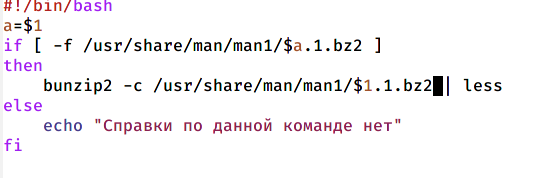
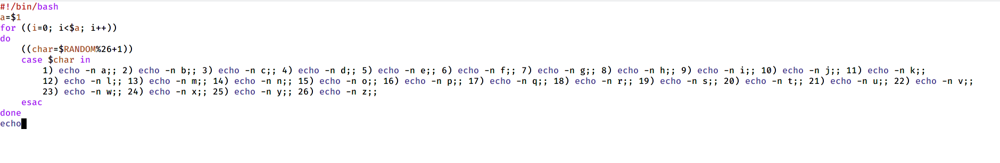

---
## Front matter
lang: ru-RU
title: Лабораторная работа №12
author: Морозова Ульяна Константиновна
date: NEC--2022, 13 May 

## Formatting
toc: false
slide_level: 2
theme: metropolis
header-includes: 
 - \metroset{progressbar=frametitle,sectionpage=progressbar,numbering=fraction}
 - '\makeatletter'
 - '\beamer@ignorenonframefalse'
 - '\makeatother'
aspectratio: 43
section-titles: true
---

# Первый скрипт

Упрощенный механиз семафоров

# Второй скрипт

Команда man через командный файл

# Третий скрипт

Вывод случайной последовательности букв латинского алфавита

