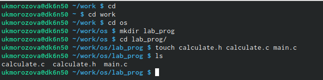
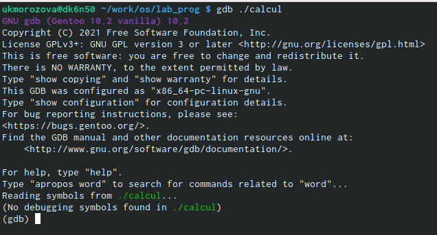

---
## Front matter
lang: ru-RU
title: Лабораторная работа №13
author: Морозова Ульяна Константиновна
date: 2022, 13 Мая

## Formatting
toc: false
slide_level: 2
theme: metropolis
header-includes: 
 - \metroset{progressbar=frametitle,sectionpage=progressbar,numbering=fraction}
 - '\makeatletter'
 - '\beamer@ignorenonframefalse'
 - '\makeatother'
aspectratio: 43
section-titles: true
---

# Создание каталога

Создаем необходимые файлы.

# Программа

Записываем текст программы в файлы.

# Makefile

Создаем makefile и с помощью него компилируем необходимые файлы.

# Отладка

С помощью gdb производим отладку.

