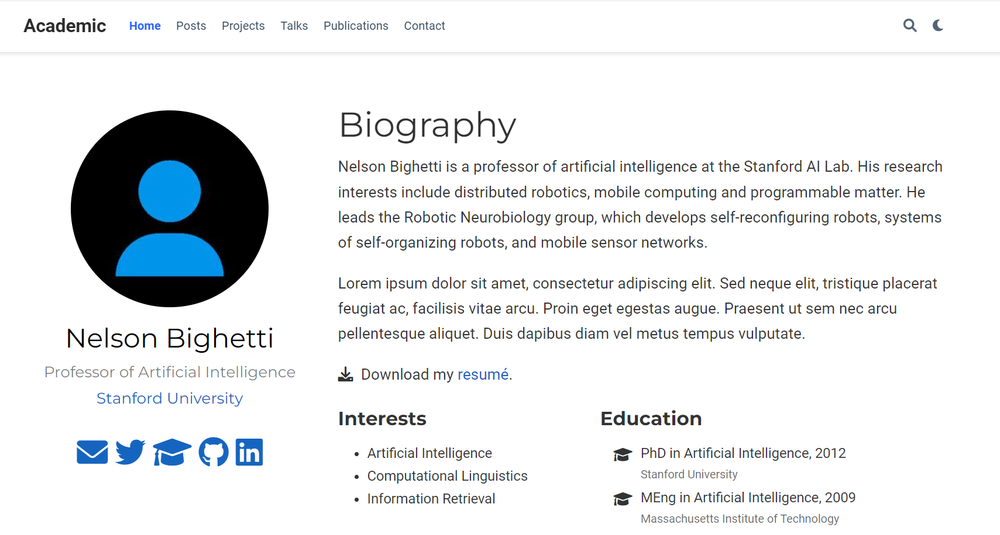
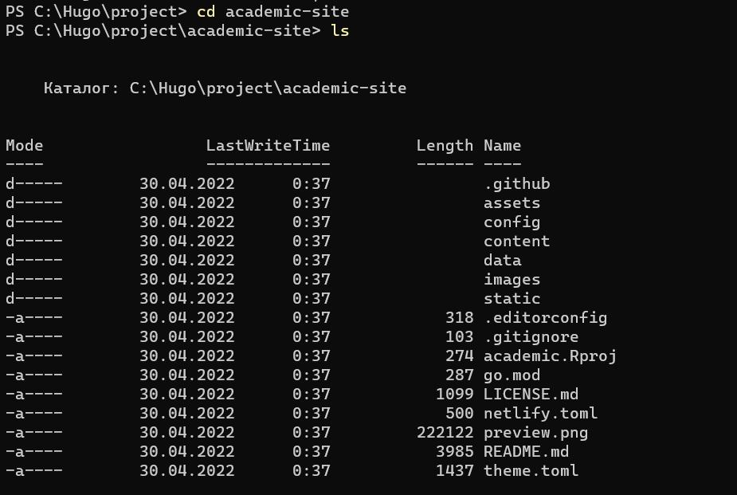

---
## Front matter
lang: ru-RU
title: Индивидуальный проект (этап 1)
author: Морозова Ульяна Константиновна
institute: RUDN University, Moscow, Russian Federation

## Formatting
toc: false
slide_level: 2
theme: metropolis
header-includes: 
 - \metroset{progressbar=frametitle,sectionpage=progressbar,numbering=fraction}
 - '\makeatletter'
 - '\beamer@ignorenonframefalse'
 - '\makeatother'
aspectratio: 43
section-titles: true
---

# Установка Hugo

- Скачивание chocolatey
- Hugo
- Golang

# Шаблон темы

Academic Theme

# Работа с сайтом

- Клонирование репозитория с github
- Содержимое папки сайта

# Хостинг Netlify

- Размещение сайта на хостинге Netlify