---
## Front matter
title: "Отчет по индивидуальному проекту (этап 1)"
subtitle: "Операционные системы"
author: "Морозова Ульяна Константиновна"

## Generic otions
lang: ru-RU
toc-title: "Содержание"

## Bibliography
bibliography: bib/cite.bib
csl: pandoc/csl/gost-r-7-0-5-2008-numeric.csl

## Pdf output format
toc-depth: 2
lof: true # List of figures
fontsize: 12pt
linestretch: 1.5
papersize: a4
documentclass: scrreprt
## I18n polyglossia
polyglossia-lang:
  name: russian
  options:
	- spelling=modern
	- babelshorthands=true
polyglossia-otherlangs:
  name: english
## I18n babel
babel-lang: russian
babel-otherlangs: english
## Fonts
mainfont: PT Serif
romanfont: PT Serif
sansfont: PT Sans
monofont: PT Mono
mainfontoptions: Ligatures=TeX
romanfontoptions: Ligatures=TeX
sansfontoptions: Ligatures=TeX,Scale=MatchLowercase
monofontoptions: Scale=MatchLowercase,Scale=0.9
## Biblatex
biblatex: true
biblio-style: "gost-numeric"
biblatexoptions:
  - parentracker=true
  - backend=biber
  - hyperref=auto
  - language=auto
  - autolang=other*
  - citestyle=gost-numeric
## Pandoc-crossref LaTeX customization
figureTitle: "Рис."
## Misc options
indent: true
header-includes:
  - \usepackage{indentfirst}
  - \usepackage{float} # keep figures where there are in the text
  - \floatplacement{figure}{H} # keep figures where there are in the text
---

# Цель работы

Установить программное обеспечение Hugo, создать свой сайт, воспользовавшись шаблоном Academic, и выложить его на бесплатный хостинг.

# Выполнение работы

1. Чтобы работать с Hugo, нужно установить необходимое программное обеспечение. Для этого на официальном сайте Hugo в разделе Install Hugo я нашла команду, устанавливающую Hugo (рис.1).
Но перед этим нужно установить программное обеспечение Chocolatey для Windows. Перешла на сайт Chocolatey, копирую предложенную команду для установки и ввела ее в консоль, открытую предварительно от имени администратора (рис.2-3). Только после этого можно устанавливать Hugo (рис.4).
Так как до этого я устанавливала Hugo себе на компьютер, терминал предложил мне перезаписать или обновить программы.

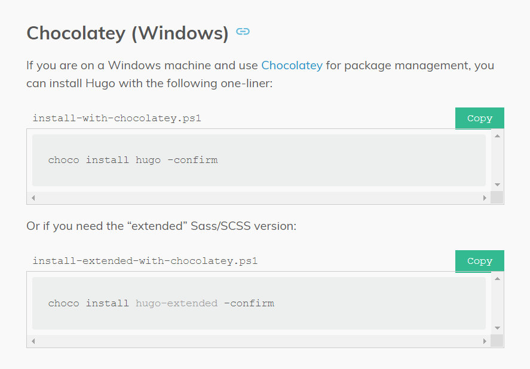{ #fig:001 width=70% }

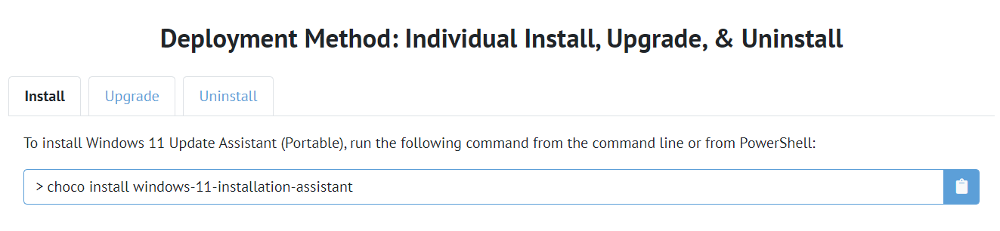{ #fig:001 width=70% }

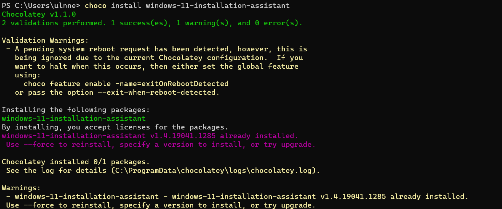{ #fig:001 width=70% }

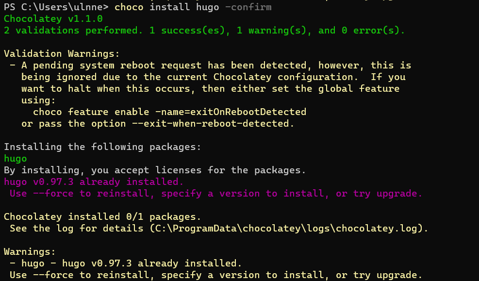{ #fig:001 width=70% }

2. Следующим пунктом надо было скачать себе предложенный шаблон темы сайта Academic. Для этого я перешла по ссылке на сайт https://wowchemy.com/hugo-themes/ и выбрала тему Academic Resume (рис.5). При попытке установить эту тему и выложить через GitHub Pages у меня возникли проблемы, вследствие чего я решила воспользоваться другим относительно бесплатным хостингом Netlify.
Для этого я нажала на Start with Academic Resume и перешла на сайт Netlify. Присоединила свой GitHub и создала репозиторий с моей новой темой academic-site (рис.6). Таким образом, я создала и разместила сайт в открытом доступе (рис.7). Если перейти на GitHub, можно увидеть новый созданный репозиторий с именем academic-site (рис.8).

{ #fig:001 width=70% }

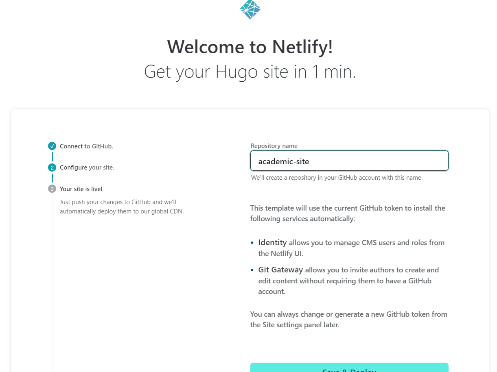{ #fig:001 width=70% }

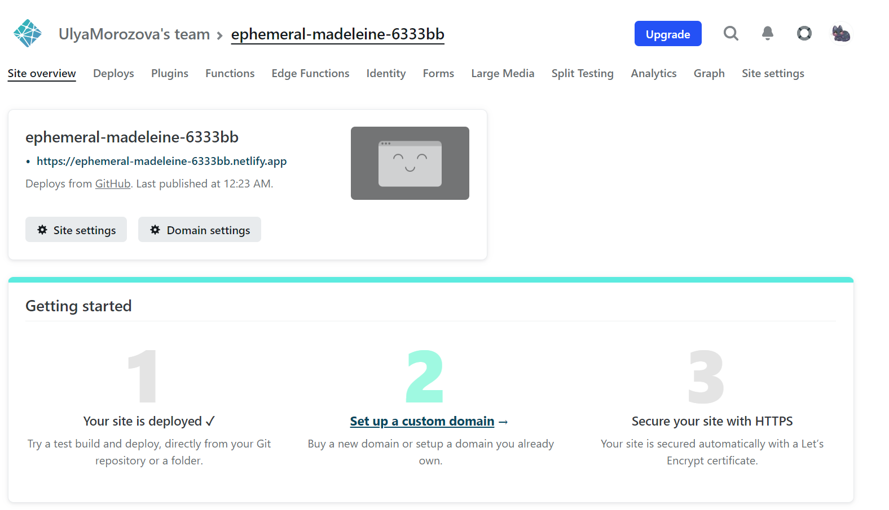{ #fig:001 width=70% }

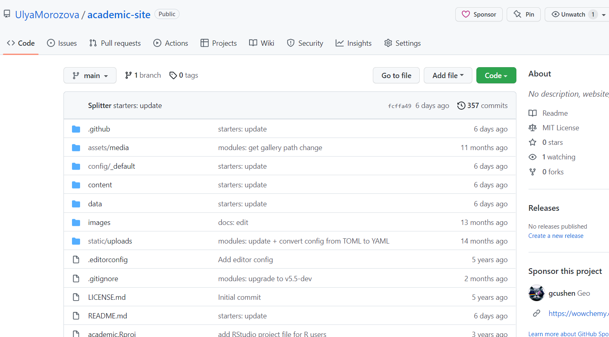{ #fig:001 width=70% }

3. Чтобы редактировать сайт, нужно скачать все файлы с репозитория на github. Для этого я клонировала репозиторий в каталог, где будет находиться мой сайт (рис.9), также ознакомилась с содержимым моего сайта (каталога) (рис.10). Сейчас мне нужен только файл ../config/_default/config.yml.
Чтобы было удобнее редактировать свой сайт, я открыла каталог через Microsoft Visual Studio (рис.11). Затем открыла файл config.yml, нашла в нем строку, начинающуюся с baseURL, и изменила url моего сайта на тот, который сгенерировал мне Netlify (рис.12). Сохранила изменения. Также я удалила файл content/home/demo.md, так как если зайти на сайт, можно увидеть зеленую полосу с рекламой, которая мне не нужна.

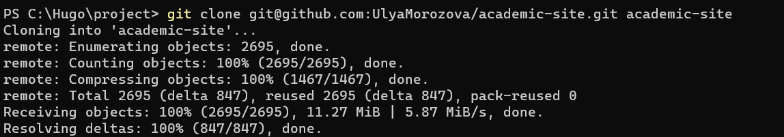{ #fig:001 width=70% }

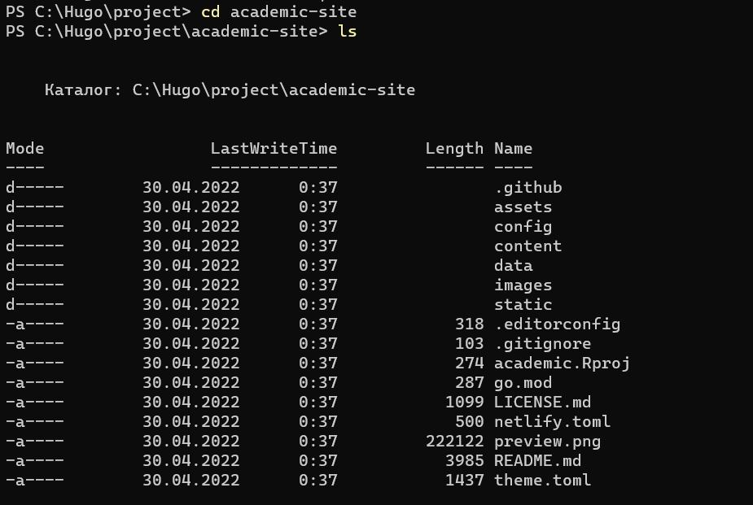{ #fig:001 width=70% }

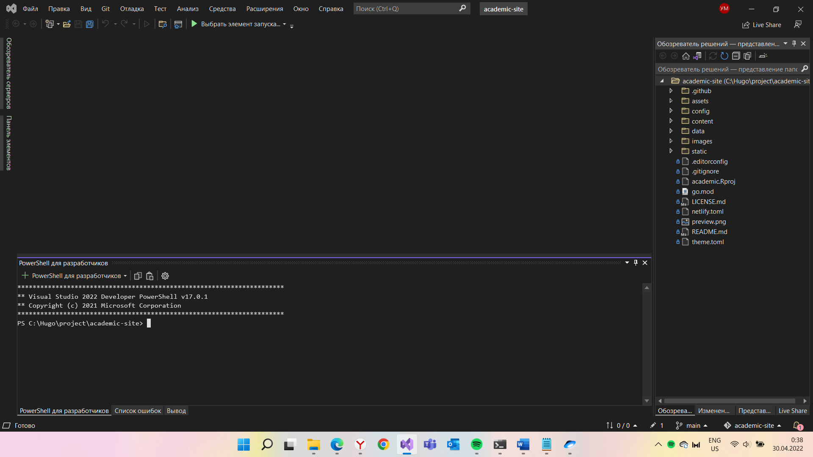{ #fig:001 width=70% }

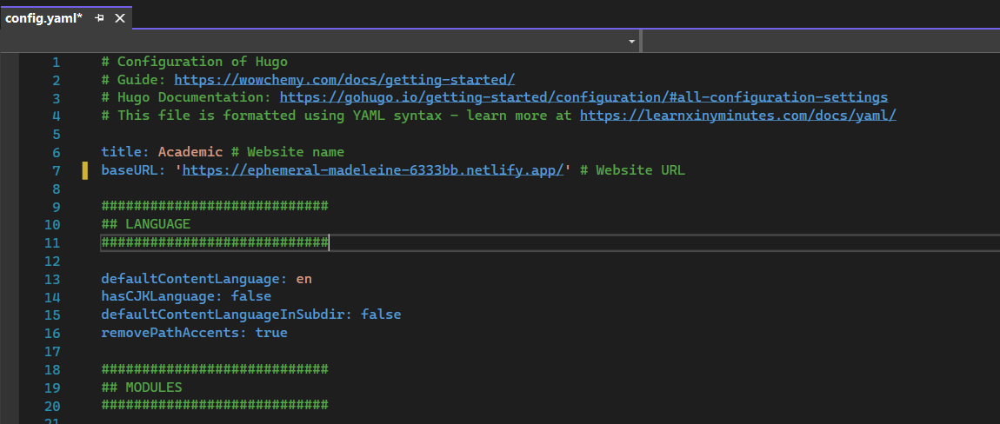{ #fig:001 width=70% }

4. Чтобы Netlify учел изменения, которые я внесла, я отправила все это GitHub (рис.13). Перейдя на свою страницу на netlify и подождав, пока закончится загрузка, я открыла свой сайт.

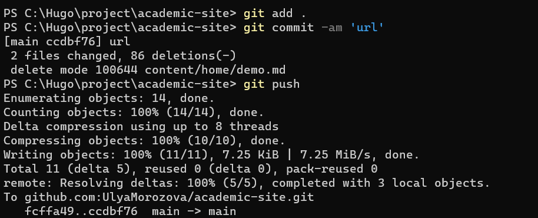{ #fig:001 width=70% }

{ #fig:001 width=70% }

# Выводы

Я установила Hugo, создала свой сайт, использовав шаблон темы и выложила его на хостинг Netlify.

::: {#refs}
:::
