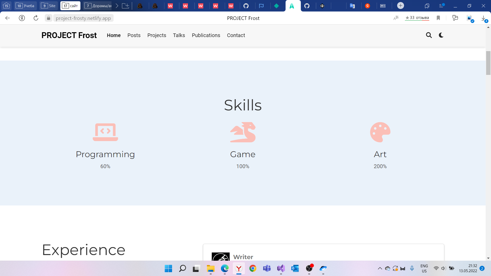
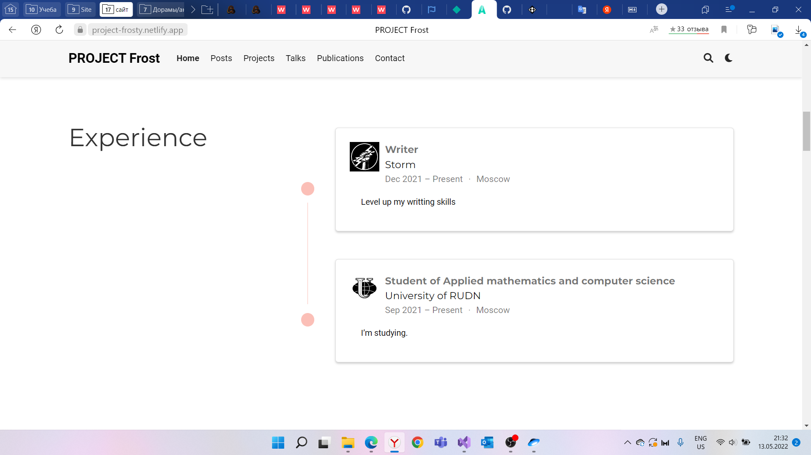
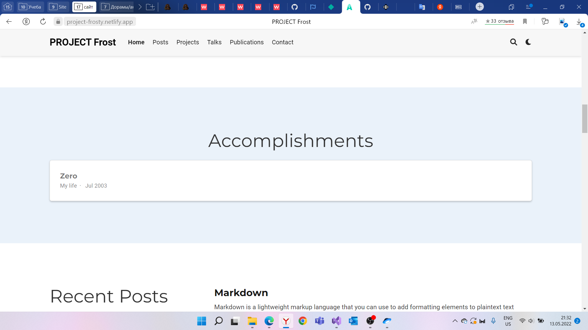

---
## Front matter
lang: ru-RU
title: Индивидуальный проект (этап 3)
author: Морозова Ульяна Константиновна
date: 2022.05.14

## Formatting
toc: false
slide_level: 2
theme: metropolis
header-includes: 
 - \metroset{progressbar=frametitle,sectionpage=progressbar,numbering=fraction}
 - '\makeatletter'
 - '\beamer@ignorenonframefalse'
 - '\makeatother'
aspectratio: 43
section-titles: true
---

# Навыки

В файле skills изменила информацию. Иконки взяла из свободного доступа.

# Опыт

В файле добавила информацию об опыте.

# Достижения

Тоже самое сделала для достижений.

# Посты

Добавила посты с помощью команды hugo new post.md