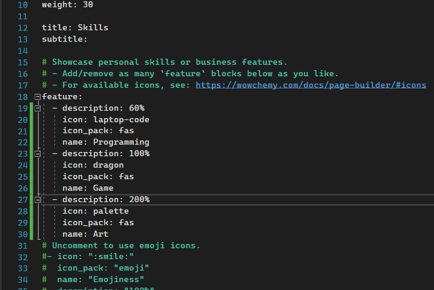
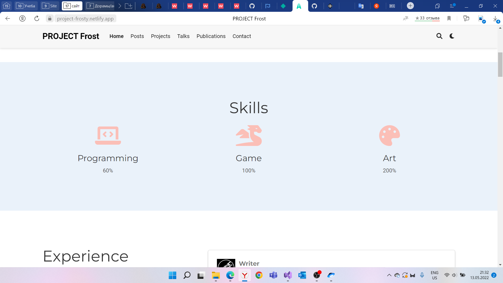
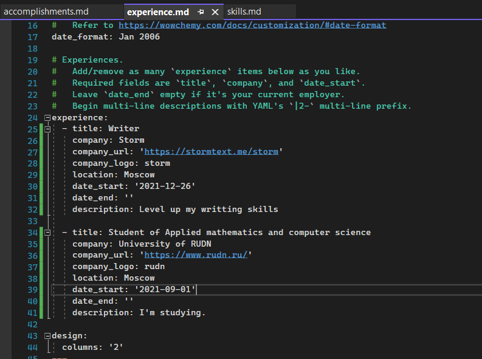
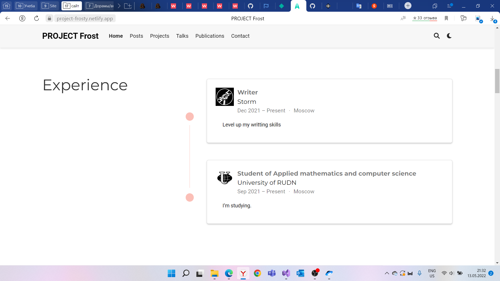
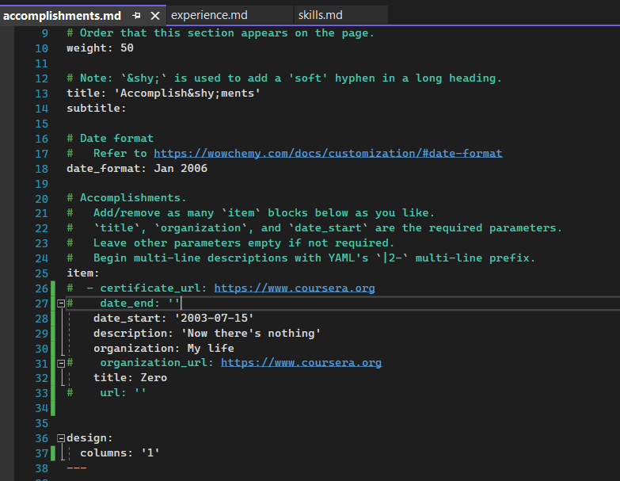
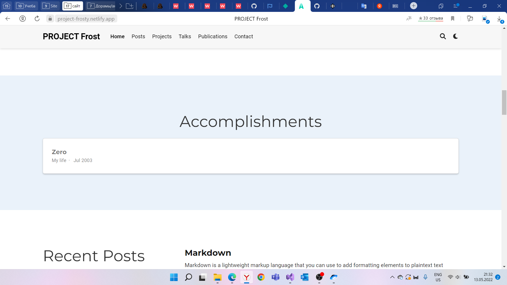
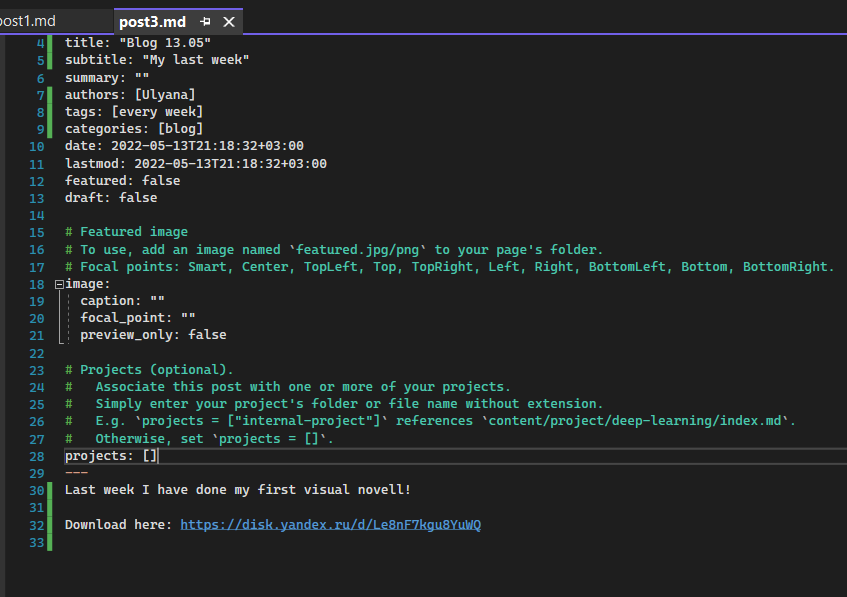
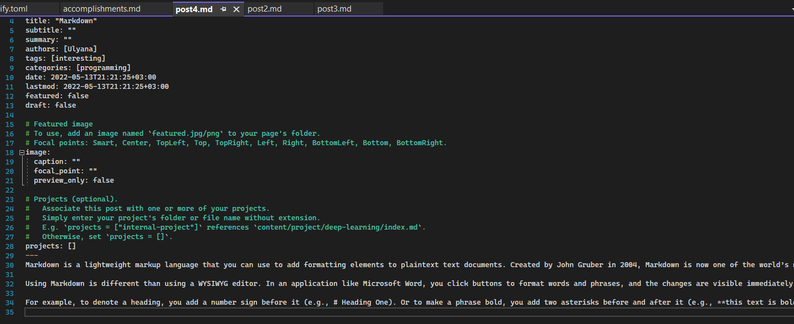
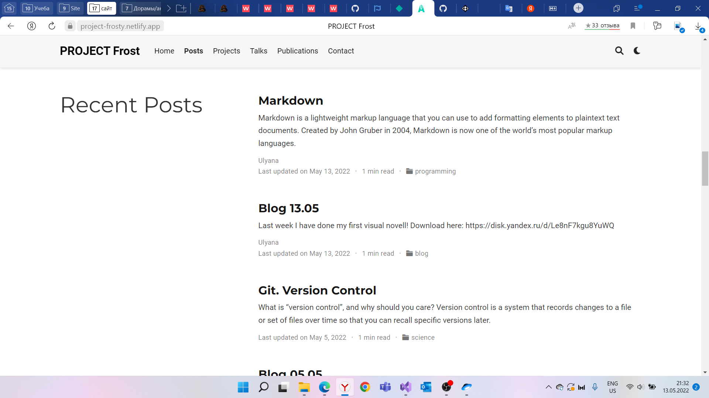

---
## Front matter
title: "Отчет к индивидуальному проекту (этап 3)"
subtitle: "Операционные системы"
author: "Морозова Ульяна Константиновна"

## Generic otions
lang: ru-RU
toc-title: "Содержание"

## Bibliography
bibliography: bib/cite.bib
csl: pandoc/csl/gost-r-7-0-5-2008-numeric.csl

## Pdf output format
toc-depth: 2
lof: true # List of figures
fontsize: 12pt
linestretch: 1.5
papersize: a4
documentclass: scrreprt
## I18n polyglossia
polyglossia-lang:
  name: russian
  options:
	- spelling=modern
	- babelshorthands=true
polyglossia-otherlangs:
  name: english
## I18n babel
babel-lang: russian
babel-otherlangs: english
## Fonts
mainfont: PT Serif
romanfont: PT Serif
sansfont: PT Sans
monofont: PT Mono
mainfontoptions: Ligatures=TeX
romanfontoptions: Ligatures=TeX
sansfontoptions: Ligatures=TeX,Scale=MatchLowercase
monofontoptions: Scale=MatchLowercase,Scale=0.9
## Biblatex
biblatex: true
biblio-style: "gost-numeric"
biblatexoptions:
  - parentracker=true
  - backend=biber
  - hyperref=auto
  - language=auto
  - autolang=other*
  - citestyle=gost-numeric
## Pandoc-crossref LaTeX customization
figureTitle: "Рис."
## Misc options
indent: true
header-includes:
  - \usepackage{indentfirst}
  - \usepackage{float} # keep figures where there are in the text
  - \floatplacement{figure}{H} # keep figures where there are in the text
---

# Цель работы

Научиться делать персональный сайт научного работника. 

# Задание

Добавить к сайту достижения.

1. Список достижений.
 - Добавить информацию о навыках (Skills).
 - Добавить информацию об опыте (Experience).
 - Добавить информацию о достижениях (Accomplishments).
2. Сделать пост по прошедшей неделе.
 - Добавить пост на тему по выбору:
    - Легковесные языки разметки.
    - Языки разметки. LaTeX.
    - Язык разметки Markdown.

# Выполнение лабораторной работы

1. Для выполнения первого пункта я открыла файл content/home/skills.md и изменила информацию о моих навыках в блоке feature (рис.1). О том, что менять и как, я прочитала в официальной документации шаблона Academic https://wowchemy.com/docs/widget/featurette/.
Там же я нашла информацию о том, как изменить иконки навыков. Иконки я взяла с бесплатной библиотеки https://fontawesome.com/icons?d=gallery&s=regular%2Csolid. Отредактированный файл я отправила на GitHub и посмотрела изменения на Netlify, который успешно построил мой сайт (рис.2).

{ #fig:001 width=70% }

{ #fig:001 width=70% }

Чтобы изменить информацию об опыте, я открыла файл content/home/experience.md и изменила информацию в блоке experience (рис.3). В частности я указала, что являюсь студентом РУДН и состою в закрытом клубе писателей Шторм. Для иконок организаций я использовала файлы в svg формате, которые разместила в папке assets\media\icons\brands.
Измененый файл я отправила на GitHub и посмотрела изменения на Netlify, который успешно построил мой сайт (рис.4).

{ #fig:001 width=70% }

{ #fig:001 width=70% }

Чтобы изменить информацию о достижениях, я открыла файл content/home/accomplishments.md и изменила информацию в блоке item (рис.5). 
Измененый файл я отправила на GitHub и посмотрела изменения на Netlify, который успешно построил мой сайт (рис.6).

{ #fig:001 width=70% }

{ #fig:001 width=70% }

2. Затем я сделала пост по прошедшей неделе. Для этого в командную строку ввела команду hugo new post/post3.md с указанием пути, куда должен создаться файл. Открыла созданный файл и отредактировала его (рис.7): изменила название поста, добавила тег и категорию, написала о прошедшей неделе.

{ #fig:001 width=70% }

Отправила изменения на GitHub и, подождав, пока Netlify изменит мой сайт, открыла созданный мною пост (рис.8).

Следующим пунктом нужно было создать пост на одну из предложенных тем. Я выбрала первую тему: "Язык разметки Markdown", и проделала те же действия, что и при создания первого поста (рис.9)

{ #fig:001 width=70% }

{ #fig:001 width=70% }

# Выводы

Я изменила информацию о моих навыках, опыте и достижениях и добавила на сайт два поста.

# Список литературы{.unnumbered}

::: {#refs}
:::
