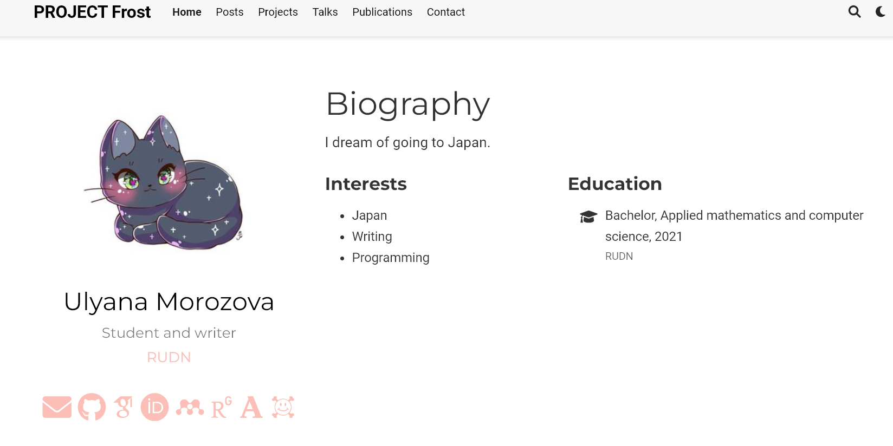
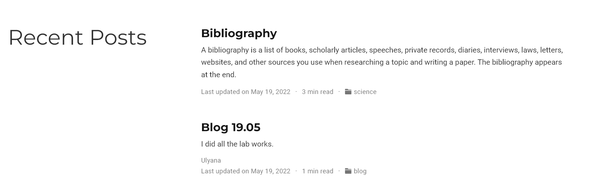

---
## Front matter
lang: ru-RU
title: Индивидуальный проект (этап 4)
author: Морозова Ульяна Константиновна
date: 2022.05.21

## Formatting
toc: false
slide_level: 2
theme: metropolis
header-includes: 
 - \metroset{progressbar=frametitle,sectionpage=progressbar,numbering=fraction}
 - '\makeatletter'
 - '\beamer@ignorenonframefalse'
 - '\makeatother'
aspectratio: 43
section-titles: true
---

# Добавление ссылок

Размещение ссылок на научные ресурсы в разделе "Биография"

# Новые посты

Создание новых постов: про прошедшую неделю и про библиографию

