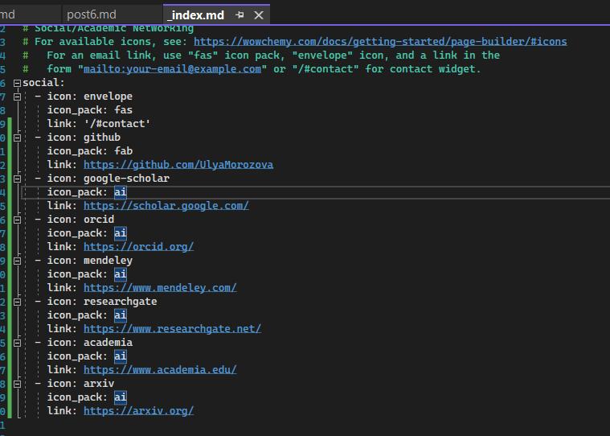
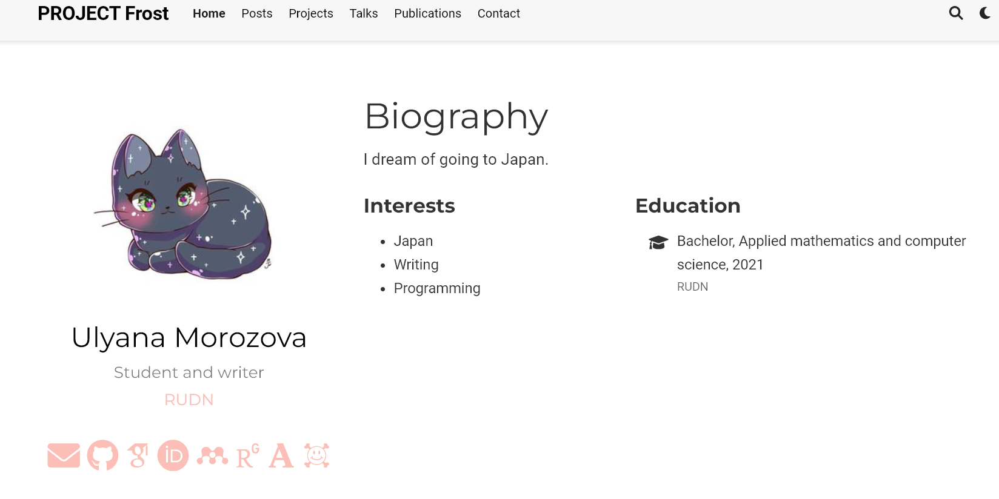
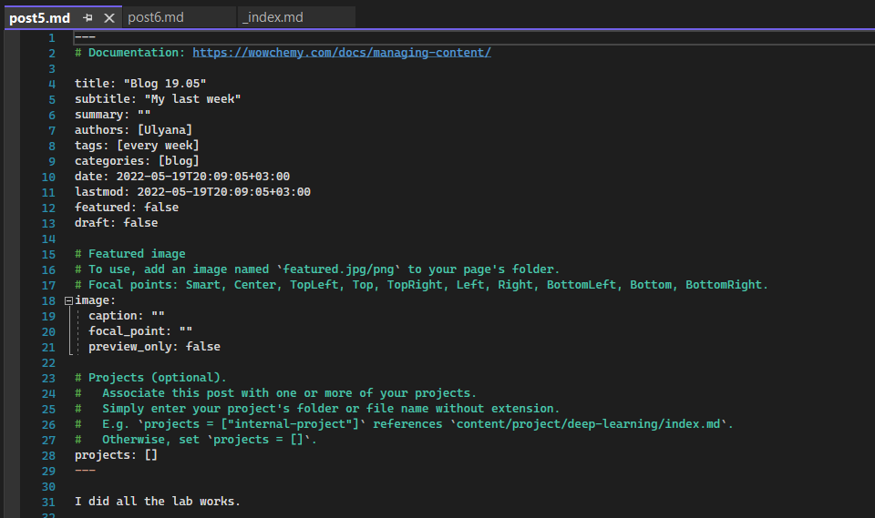
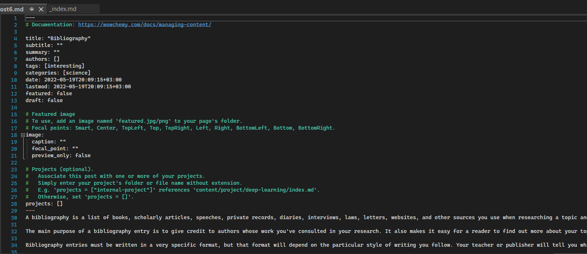
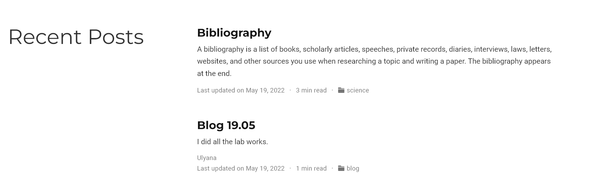

---
## Front matter
title: "Отчет по индивидуальному проекту (этап 4)"
subtitle: "Операционные системы"
author: "Морозова Ульяна Константиновна"

## Generic otions
lang: ru-RU
toc-title: "Содержание"

## Bibliography
bibliography: bib/cite.bib
csl: pandoc/csl/gost-r-7-0-5-2008-numeric.csl

## Pdf output format
toc-depth: 2
lof: true # List of figures
fontsize: 12pt
linestretch: 1.5
papersize: a4
documentclass: scrreprt
## I18n polyglossia
polyglossia-lang:
  name: russian
  options:
	- spelling=modern
	- babelshorthands=true
polyglossia-otherlangs:
  name: english
## I18n babel
babel-lang: russian
babel-otherlangs: english
## Fonts
mainfont: PT Serif
romanfont: PT Serif
sansfont: PT Sans
monofont: PT Mono
mainfontoptions: Ligatures=TeX
romanfontoptions: Ligatures=TeX
sansfontoptions: Ligatures=TeX,Scale=MatchLowercase
monofontoptions: Scale=MatchLowercase,Scale=0.9
## Biblatex
biblatex: true
biblio-style: "gost-numeric"
biblatexoptions:
  - parentracker=true
  - backend=biber
  - hyperref=auto
  - language=auto
  - autolang=other*
  - citestyle=gost-numeric
## Pandoc-crossref LaTeX customization
figureTitle: "Рис."
lofTitle: "Список иллюстраций"
## Misc options
indent: true
header-includes:
  - \usepackage{indentfirst}
  - \usepackage{float} # keep figures where there are in the text
  - \floatplacement{figure}{H} # keep figures where there are in the text
---

# Задание

Добавить к сайту ссылки на научные и библиометрические ресурсы.

1. Зарегистрироваться на соответствующих ресурсах и разместить на них ссылки на сайте:
 - eLibrary : https://elibrary.ru/;
 - Google Scholar : https://scholar.google.com/;
 - ORCID : https://orcid.org/;
 - Mendeley : https://www.mendeley.com/;
 - ResearchGate : https://www.researchgate.net/;
 - Academia.edu : https://www.academia.edu/;
 - arXiv : https://arxiv.org/;
 - github : https://github.com/.
2. Сделать пост по прошедшей неделе.
3. Добавить пост на тему по выбору:
 - Оформление отчёта.
 - Создание презентаций.
 - Работа с библиографией.

# Выполнение индивидуального проекта

1. Для выполнения первого задания я открыла файл content\authors\admin\_index.md. В блоке social я добавила ссылки на академические ресурсы и их иконки из пакета Academic (рис.1).

{ #fig:001 width=70% }

Затем я загрузила изменения на GitHub, через некоторое время Netlify обновил мой сайт (рис.2).

{ #fig:001 width=70% }

2. Затем я сделала пост по прошедшей неделе. Для этого в командную строку ввела команду hugo new post/post5.md с указанием пути, куда должен создаться файл. Открыла созданный файл и отредактировала его (рис.3): изменила название поста, добавила тег и категорию, написала о прошедшей неделе.

{ #fig:001 width=70% }

Следующим заданием было написать пост по одной из тем по выбору. Я выбрала тему "Работа с библиографией". Создала файл post6.md и отредактировала его (рис.4).

{ #fig:001 width=70% }

Загразила оба поста на GitHub и просмотрела изменения в моем сайте (рис.5)

{ #fig:001 width=70% }

# Выводы

Я добавила новую информацию о себе на сайт и новые посты.

::: {#refs}
:::
