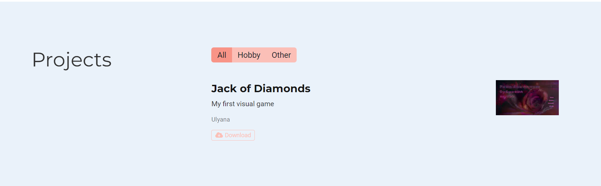
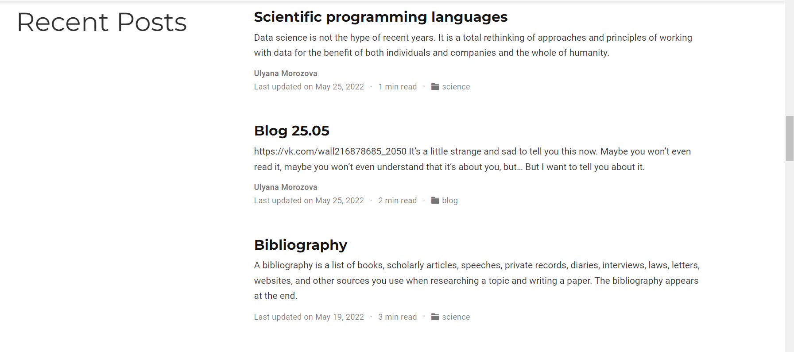

---
## Front matter
lang: ru-RU
title: Индивидуальный проект (этап 5)
author: Морозова Ульяна Константиновна
date: 2022.05.26

## Formatting
toc: false
slide_level: 2
theme: metropolis
header-includes: 
 - \metroset{progressbar=frametitle,sectionpage=progressbar,numbering=fraction}
 - '\makeatletter'
 - '\beamer@ignorenonframefalse'
 - '\makeatother'
aspectratio: 43
section-titles: true
---

# Проект

Используя команды hugo, создала папку проекта и отредактировала нужный файл. В собранном виде проект на сайте выглядит так:

# События

Создала папку события, отредактировала файл и на вызоде получила:

# Посты

Добавила новые посты: по прошедшей неделе и на выбранную тему.

