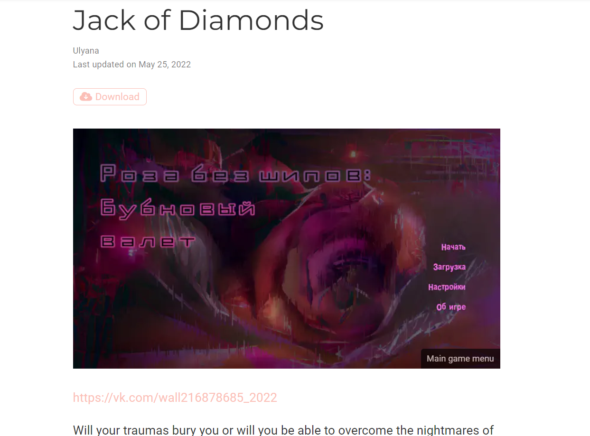

---
## Front matter
title: "Отчет по индивидуальному проекту (этап 5)"
subtitle: "Операционные системы"
author: "Морозова Ульяна Константиновна"

## Generic otions
lang: ru-RU
toc-title: "Содержание"

## Bibliography
bibliography: bib/cite.bib
csl: pandoc/csl/gost-r-7-0-5-2008-numeric.csl

## Pdf output format
toc-depth: 2
lof: true # List of figures
fontsize: 12pt
linestretch: 1.5
papersize: a4
documentclass: scrreprt
## I18n polyglossia
polyglossia-lang:
  name: russian
  options:
	- spelling=modern
	- babelshorthands=true
polyglossia-otherlangs:
  name: english
## I18n babel
babel-lang: russian
babel-otherlangs: english
## Fonts
mainfont: PT Serif
romanfont: PT Serif
sansfont: PT Sans
monofont: PT Mono
mainfontoptions: Ligatures=TeX
romanfontoptions: Ligatures=TeX
sansfontoptions: Ligatures=TeX,Scale=MatchLowercase
monofontoptions: Scale=MatchLowercase,Scale=0.9
## Biblatex
biblatex: true
biblio-style: "gost-numeric"
biblatexoptions:
  - parentracker=true
  - backend=biber
  - hyperref=auto
  - language=auto
  - autolang=other*
  - citestyle=gost-numeric
## Pandoc-crossref LaTeX customization
figureTitle: "Рис."
## Misc options
indent: true
header-includes:
  - \usepackage{indentfirst}
  - \usepackage{float} # keep figures where there are in the text
  - \floatplacement{figure}{H} # keep figures where there are in the text
---

# Задание

Добавить к сайту все остальные элементы.
1. Сделать записи для персональных проектов.
2. Сделать пост по прошедшей неделе.
3. Добавить пост на тему по выбору.
 - Языки научного программирования.

# Выполнение этапа №5

1. Для выполнения первого пункта нужно создать папку с файлов в каталоге content/project, используя специальную команду (рис.1).

{ #fig:001 width=70% }

Затем отредактируем файл index.md в созданной нами папке проекта (рис.2-3) и добавим картинку, переименновав в featured.jpg.

{ #fig:001 width=70% }

{ #fig:001 width=70% }

Изменим предстоящие встречи. С помощью команды (рис.4) создадим новую папку в каталоге content/event. Отредактируем файл index.md в папке exam (рис.5).

{ #fig:001 width=70% }

{ #fig:001 width=70% }

Так как у меня нет никаких публикаций, я удалила пример публикации.

Изменим также файл content/home/contact.md (рис.6).

{ #fig:001 width=70% }

Отправим все изменения на github, чтобы Netlify построил мой сайт (рис.7-11).

{ #fig:001 width=70% }

{ #fig:001 width=70% }

{ #fig:001 width=70% }

{ #fig:001 width=70% }

{ #fig:001 width=70% }

2. Создадим два файла постов и отредактируем их (рис.12-13)

{ #fig:001 width=70% }

{ #fig:001 width=70% }

Отправим на GitHub и посмотрим изменения на сайте (рис.14).

{ #fig:001 width=70% }

# Выводы

Я полностью индивидуализировала свой сайт, добавив свой проект, предстоящие встречи и контакты.

::: {#refs}
:::
