---
## Front matter
title: "Отчет к индивидуальному проекту (этап 6)"
subtitle: "Операционные системы"
author: "Морозова Ульяна Константиновна"

## Generic otions
lang: ru-RU
toc-title: "Содержание"

## Bibliography
bibliography: bib/cite.bib
csl: pandoc/csl/gost-r-7-0-5-2008-numeric.csl

## Pdf output format
toc-depth: 2
lof: true # List of figures
fontsize: 12pt
linestretch: 1.5
papersize: a4
documentclass: scrreprt
## I18n polyglossia
polyglossia-lang:
  name: russian
  options:
	- spelling=modern
	- babelshorthands=true
polyglossia-otherlangs:
  name: english
## I18n babel
babel-lang: russian
babel-otherlangs: english
## Fonts
mainfont: PT Serif
romanfont: PT Serif
sansfont: PT Sans
monofont: PT Mono
mainfontoptions: Ligatures=TeX
romanfontoptions: Ligatures=TeX
sansfontoptions: Ligatures=TeX,Scale=MatchLowercase
monofontoptions: Scale=MatchLowercase,Scale=0.9
## Biblatex
biblatex: true
biblio-style: "gost-numeric"
biblatexoptions:
  - parentracker=true
  - backend=biber
  - hyperref=auto
  - language=auto
  - autolang=other*
  - citestyle=gost-numeric
## Pandoc-crossref LaTeX customization
figureTitle: "Рис."
lofTitle: "Список иллюстраций"
## Misc options
indent: true
header-includes:
  - \usepackage{indentfirst}
  - \usepackage{float} # keep figures where there are in the text
  - \floatplacement{figure}{H} # keep figures where there are in the text
---

# Задание

Размещение двуязычного сайта на Github.

1. Сделать поддержку английского и русского языков.
2. Разместить элементы сайта на обоих языках.
3. Разместить контент на обоих языках.
4. Сделать пост по прошедшей неделе.
6. Добавить пост на тему по выбору (на двух языках).

# Выполнение 

1. Для поддержки двух языков, нужно в файле config/_default/languages.yaml указать второй язык (рис.1) и путь для каталога, в котором будет храниться контент на другом языке.

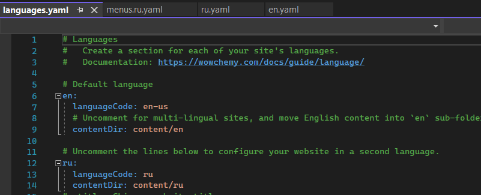{ #fig:001 width=70% }

Так как изначально мой сайт был на английском языке, то я указала вторым языком русский. Затем создала в папке content два каталога en и ru (рис.2), в которых соответстсвенно будут храниться материалы на английском и русском языках.

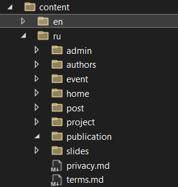{ #fig:001 width=70% }

Помимо этого я продублировала файл config/_default/menus.yaml: один назвала menus.ru.yaml (рис.3), в котором указала названия главного меню на русском, другой переименновала menus.en.yaml, оставив его содержимое без изменений.

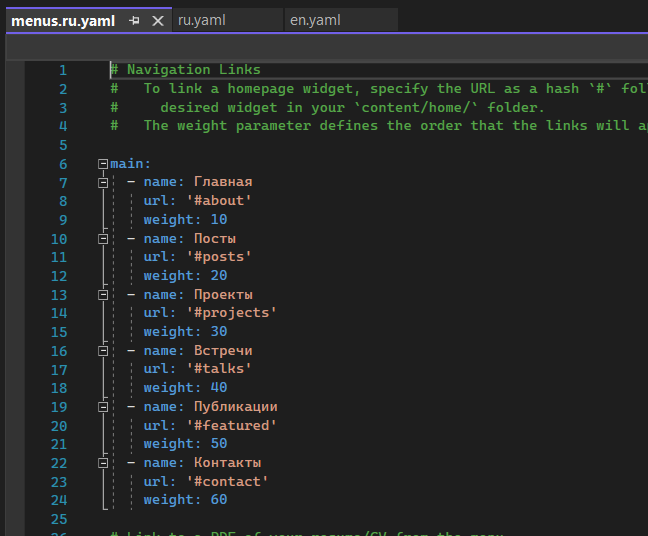{ #fig:001 width=70% }

Также я создала в папке моего сайте каталог i18n и создала два файла en.yaml (рис.4) и ru.yaml (рис.5), чье содержимое я взяла из официальной документации к сайту Academic. Это нужно было сделать, чтобы, помимо основного контента, интерфейс также поддерживал два языка. 

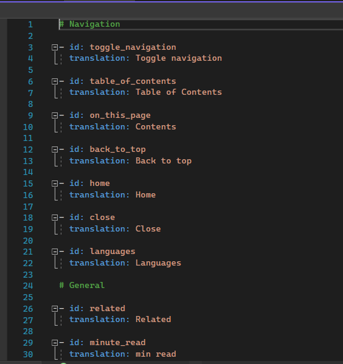{ #fig:001 width=70% }

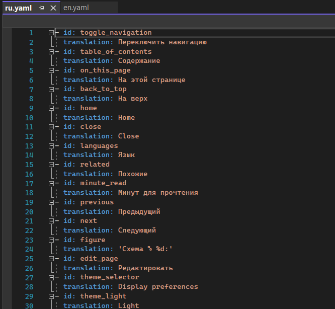{ #fig:001 width=70% }

2. Затем продублировав содержимое папки en в папку ru, я перевела всё на русский язык. Отправила все изменения на GitHub и, дождавшись, пока Netlify построит мой сайт, проверила работу сайта (рис.6-10).

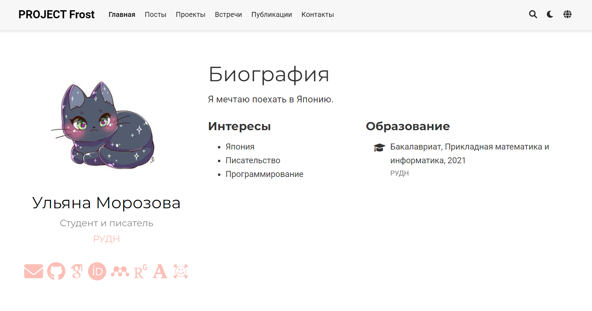{ #fig:001 width=70% }

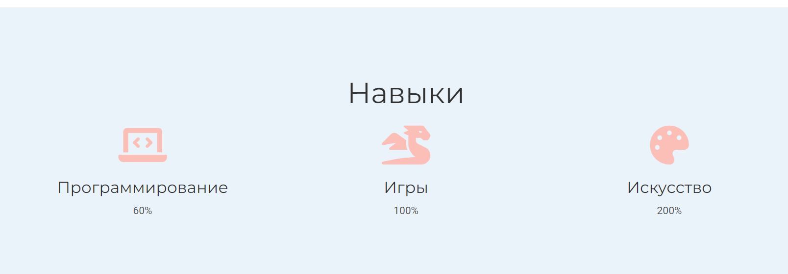{ #fig:001 width=70% }

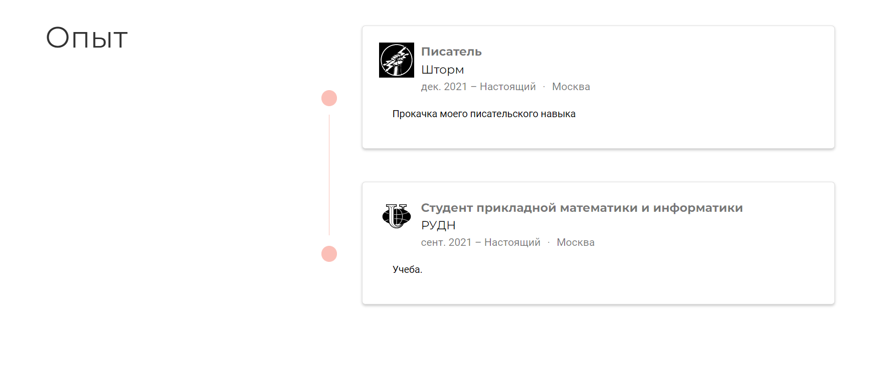{ #fig:001 width=70% }

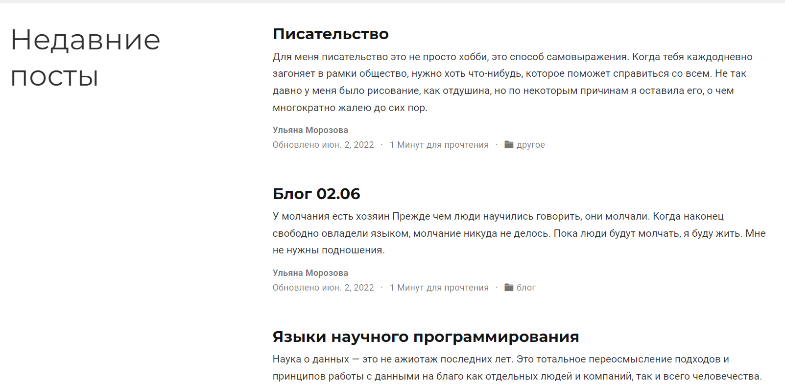{ #fig:001 width=70% }

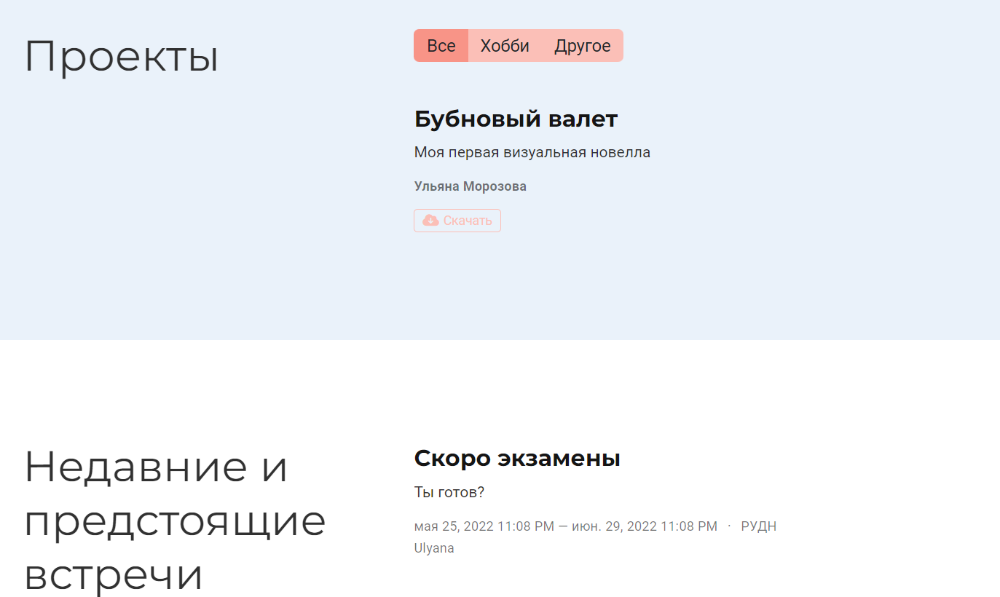{ #fig:001 width=70% }

3. Создала два файла постов и отредактировала их (рис.11-12). Потом перевела их на русский язык.

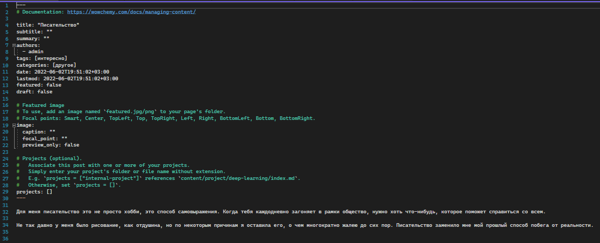{ #fig:001 width=70% }

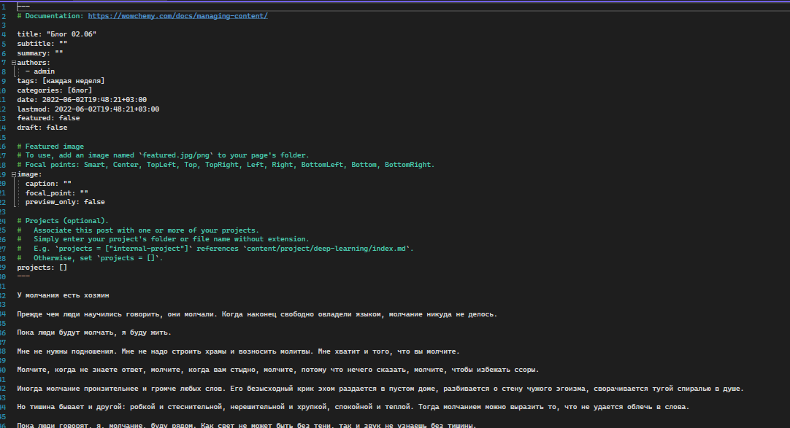{ #fig:001 width=70% }

Отправила на GitHub и посмотрела изменения на сайте (рис.14).

{ #fig:001 width=70% }

# Выводы

Я разместила свой двуязычный сайт, перевела его содержимое на русский язык.

::: {#refs}
:::
